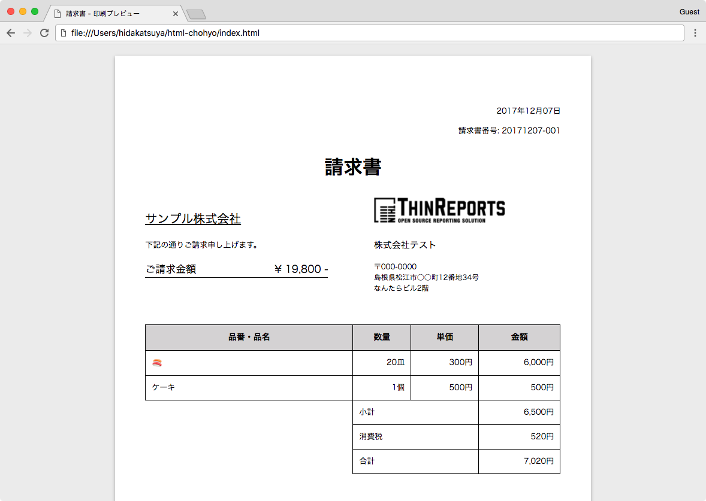

# HTML帳票

[第3回フロントエンド勉強会 in 山陰](https://front-end.connpass.com/event/71553/)で発表した際のサンプルコード。

 - フロントエンド技術のみによる帳票印刷機能を作ってみる
 - 印刷プレビュー画面
 - Paged Media (CSS3) による用紙、印刷のコントロール



## Presentation

https://speakerdeck.com/hidakatsuya/frontend-study-group-in-sannin-3rd (Speaker Deck)

## Usage

 1. index.html をブラウザで開く
 2. Cmd+P とかで印刷する

## Change paper size

index.html の

```html
<!DOCTYPE html>
<html lang="ja">

<head>
  <meta charset="utf-8">
  <title>請求書 - 印刷プレビュー</title>
  <link rel="stylesheet" href="style.css" type="text/css">
  <style>@page { size: A4 }</style>
</head>

<body class="A4">
  <section class="sheet">
```

`@page { size: A4 }` と `<body class="A4">` を変更する。

 - `@page...` - 印刷時の用紙の定義
   - see https://drafts.csswg.org/css-page-3/#typedef-page-size-page-size
 - `<body...` - プレビュー画面用の用紙サイズスタイル
   - style.css での定義が必要

## Note

実用したい場合は https://github.com/cognitom/paper-css を使えば良いと思います。

## Copyright

2017 (c) Katsuya Hidaka.
